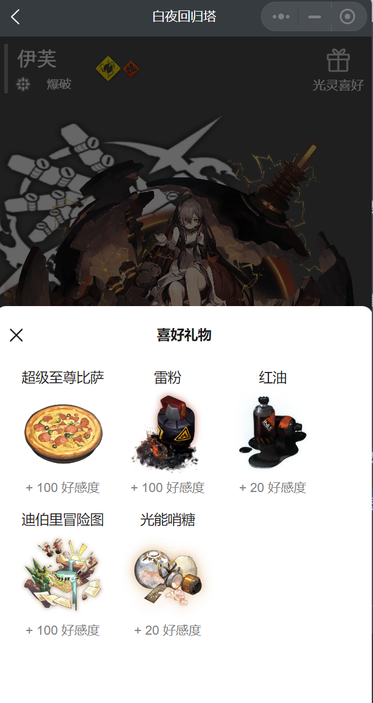
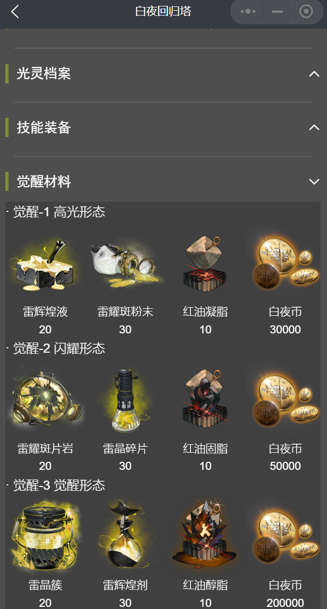
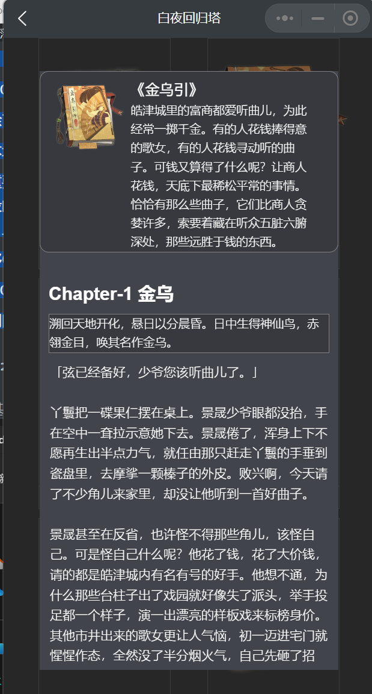
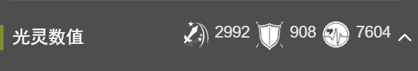

# V1.0.2 更新日志-详细说明

1. Feature Add

   - 跟进 风暴停转之时 版本的光灵数据；补充缺失的丹棠、李天闲数据。

   - 光灵详情页面添加礼物喜好&&觉醒材料栏。
          现在在光灵详情页面可以查看光灵礼物喜好和觉醒材料了。光灵礼物喜好通过点击顶页的【光灵喜好】即可查看：
         
         光灵觉醒材料则在最后一项资料栏查看，也就是页面末尾（是的，这非常不方便。计划在未来的UI改版时优化相关设计——但这一块工作量真的很大，我也不清楚什么时候有一大块的时间精力去做这件事）：
         

   - 增添工具栏页面

   - 在工具栏页面添加了CG画廊（目前不包括人物剧情立绘）、阿斯特拉故事录。
     现在在首页添加了工具箱栏，该页面会存放一些不方便在目前UI设计下存放在光灵详情页面的资料页。目前有**CG画廊**（不完整版）和作为世界观补充的**阿斯特拉故事集**。同样这里会存在一个加载公告的公告板。

     目前已知存在的问题是：在第一次加载时可能会出现漫长的灰屏。我计划在下周的版本更新中优化该问题。

     CG画廊（目前并不完整，只包括剧情立绘、场景立绘以及加载动画。也许在下周的版本更新里会优化该页面。）：
     

     阿斯特拉故事集是巨像派遣任务有概率得到的书籍的汇总，点击书籍即可阅读相应故事，点击边缘黑幕即可关闭对应窗口：
     

   - CG、光灵皮肤立绘等目前支持点击放大查看与保存（长按图片即可保存）。

2. Feature Change

   - 【重要】目前暂时放弃光灵最大数值选项的显示。原光灵最大数值的显示块将被光灵最大觉醒阶段的max值替换。
     如：上限为觉3的光灵显示觉3max数值；上限只为觉2的三星光灵显示觉2max数据。
     所谓光灵最大数值显示块是指光灵详情页的【光灵数值】栏。原先这一部分数据来源于网上Wiki，在发现个别光灵数据存在较大讹误后，我们更换数据来源为Kimaris。最大上限数据需要计算处理，我计划在未来有精力的时候着手此事——啊，又是计划。
     光灵数值栏上的光灵最大数值选项：
     
   - 删除了无用的资源文件列表清单以及相应逻辑代码。
   - 向本地资源路径中添加了新的资源路径。
   - 迁移CG资源云端存储地址，因此v1.0.1版本会在2023.8.5停止支持。您无需担心这个问题，微信会自动更新小程序到最新版本。

3. Feature Correct （是的，这叫特性，不叫Bug）

   - 个别图标资源缺失的问题。

欢迎您前往Github通过Issue提交相关反馈：github.com/WendaoLee/alchemy-starts-wechat