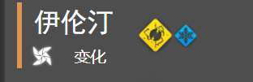
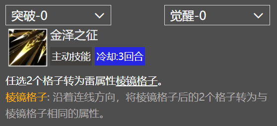

# V1.0.3.3 更新日志-详细说明

1.Feature Add

- 光灵详情页面添加表示稀有度的竖条，颜色与主页同步。在之前这一块一直都是灰色的。
  
- 对于一些光灵技能描述中出现的特性（如 溅射、强化格子），添加了相关描述。
  

2.Feature Update

- 提高了切换皮肤的按钮组（实际上是文本组，因为微信默认的按钮太难调整了）选中与不选中的颜色区分度。
- 更改了【觉醒材料】栏的背景配色
- 略微修复了【觉醒材料】栏的排版，使它稍微能够适配小尺寸屏幕。

3.Feature Fix

- 略微修复了【觉醒材料】栏的排版，使它稍微能够适配小尺寸屏幕。
- 技能个别特性描述文本的颜色可以正常应用了