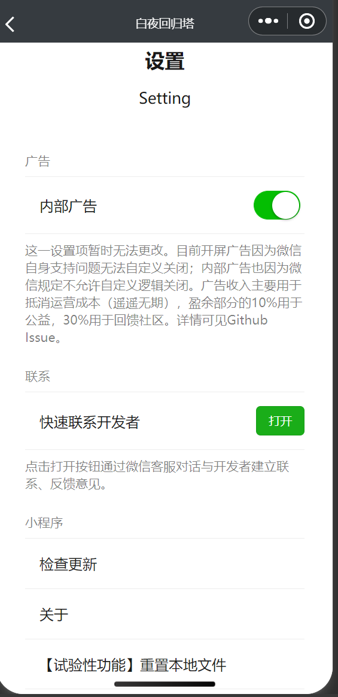

# V1.0.3 更新日志-详细说明

1. Feature Correct

-  修复没有第二属性的三、四星光灵在显示页面的上多余黑框问题。
  在过去的版本里，因为前端逻辑问题，在三、四星光灵上会有多余的黑框。
-  修复光灵详情页面以及其他页面中一些理应支持复制的文字无法复制的问题。
  现在这些地方的文字如今可以复制了：
  1. 光灵档案的所有内容
  2. 技能装备中的装备描述
  3. 阿斯特拉故事集中的书本简介（即点开后的第一段文字）
-  修复光灵数据在本地储存存在时无法得到更新的问题。
  在本版本引入了新的资源配置文件以实现对资源的版本控制。
-  修复光灵武器图片无法点击放大的问题。

2. Feature Add

-  工具箱页面添加【设置】页。设置页内可主动清空本地储存、检查更新。同时将原本首页Tabbar中的【关于】页合并到了【设置页】之中。
  设置页目前有以下配置项：
  

  1. 暂时无法修改的广告项（是的，我们这个版本引入了广告维持运营。但很可惜，目前因为微信的规定我们不能对广告自定义关闭，希望以后会更改这项规定吧）（我们不会把广告植入到小程序的主要功能光灵图鉴中从而导致使用体验的破坏，这是我们的承诺。目前广告只存在在【关于】与【画廊】页中（画廊会产生大量CDN流量，所以放个广告勉强回收一下成本））。

  2. 快速联系开发者。您可以通过点击打开按钮通过微信客服对话功能与我取得联系、反馈意见。

  3. 检查更新。之后您可以在新版本推出时通过该项手动进行更新。

  4. 关于。原来的关于页。

  5. 【实验性功能】重置本地文件。当您出现“光灵数据缺失”或者显示异常的问题时，可通过该项重置本地文件以重新加载相应资源。大多数用户不会遇到这个问题，这个选项针对的是早期v1.0.1的使用用户可能会因为当时数据的缺失而导致页面一直停滞在缺失状态（即使后面已经补充完整）上。如果该项没有作用，请删除小程序后重新加载。

     请注意，目前旧印的数据依然缺失，因此遇见旧印数据缺失的问题不需要使用该项。
     同时，事实上因为本版本引入的资源控制机制，事实上您总能在版本更新时更新相关资源。

-  本地资源路径添加配置文件与资源检查文件。

3. 关于广告
   广告主要用于抵消运营成本（目前遥遥无期）。其中盈余部分的10%用于公益，30%用于回馈社区。您可以访问 https://github.com/WendaoLee/alchemy-starts-wechat/issues/5 查看相应开支公示。
